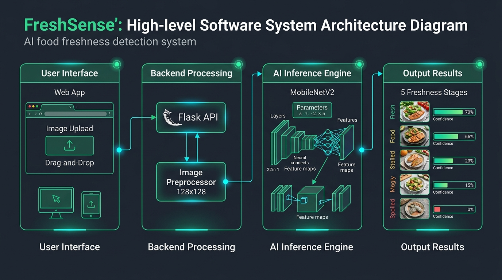

<div align="center">

# 🍃 FreshSense

### Automated Food Freshness Diagnostic Platform Powered by Deep Learning & Computer Vision

[](https://www.python.org/)
[](https://flask.palletsprojects.com/)
[](https://keras.io/)
[](https://keras.io/api/applications/mobilenet/)
[](#-machine-learning--benchmarks)
[](#-team-members)

<p align="center">
  <b>Instant, non-invasive produce quality classification across five biological degradation stages in &lt; 850ms on standard CPU.</b>
</p>

[Quick Start](#-quick-start-guide) • [Architecture](#-system-architecture) • [Tech Stack](#-technology-stack) • [Classification Scale](#-5-stage-freshness-spectrum) • [Deliverables](#-project-deliverables) • [Team](#-team-members)

</div>

---

## ⚡ Quick Start Guide

Follow these simple steps to run **FreshSense** locally on your machine.

### 1. Clone or Open the Repository
```bash
git clone https://github.com/your-username/FreshSense.git
cd FreshSense
```

### 2. Navigate to the App Folder
> **Important:** The web application and server live inside the `FreshSense` directory:

```bash
cd FreshSense
```

### 3. Install Required Dependencies
Ensure you have Python 3.10+ installed, then run:

```bash
pip install -r requirements.txt
```

*(Or install packages manually: `pip install flask keras numpy pillow scipy jax jaxlib`)*

### 4. Launch the Application
Run the Flask server:

```bash
python app.py
```

You will see the model initialize and the server start:
```
Loading MobileNetV2 model …
Model loaded successfully.
 * Running on http://127.0.0.1:5000
```

### 5. Open in Your Browser
- **Diagnostic Web App:** [http://127.0.0.1:5000](http://127.0.0.1:5000)
- **Interactive Presentation Slide Deck:** [http://127.0.0.1:5000/presentation](http://127.0.0.1:5000/presentation)

---

## 📌 Project Overview

Food waste is a **\$1.3 Trillion** global economic and environmental catastrophe. Approximately **one-third** of all perishable food produced globally is discarded, with fruits and vegetables experiencing the highest spoilage rates.

### The Problem
* **Subjective Human Inspection:** Manual sensory checking (smell, touch, sight) is inconsistent, differs across handlers, and carries an estimated **40% error rate**.
* **The Binary Fallacy:** Traditional inspection algorithms only distinguish between **"Fresh"** and **"Rotten"**, completely missing transitional degradation stages where food is still edible or suited for immediate cooking/stewing.
* **Heavy Cloud Overhead:** Most modern AI vision models demand expensive, high-latency GPU cloud instances.

### The Solution: FreshSense
**FreshSense** is a lightweight, edge-friendly computer vision platform that accepts any standard produce photo and classifies its freshness across **five discrete biological stages**:

```
[ Fresh ] ───> [ Slightly Aged ] ───> [ Stale ] ───> [ Spoiled ] ───> [ Rotten ]
 Harvest grade     Minor dehydration     Cook / Puree      Microbial onset     Bio-waste
```

It delivers:
1. **Sub-850ms CPU Inference:** Runs seamlessly on standard laptops without GPU/CUDA.
2. **Explainable Confidence Distribution:** Displays full probability vectors across all 5 categories.
3. **Actionable Culinary Advice:** Automated guidance tailored to the exact freshness stage.
4. **Persistent Audit Log:** Chronological scan history with thumbnails and timestamps.

---

## 🏗 System Architecture

The following high-level communication diagram illustrates the end-to-end data pipeline from user ingestion to neural network classification and persistent storage:

<div align="center">
  
</div>

### Data Flow Stages:
1. **Client UI:** Users drag and drop or browse food images (`.jpg`, `.jpeg`, `.png`, `.webp`) with instant in-browser preview.
2. **Backend Gateway (Flask 3.1):** Multipart file decoding, UUID assignment, and image streaming.
3. **Preprocessing Engine (Pillow):** Image standardization &rarr; bicubic resize to `128 × 128 × 3` &rarr; float32 normalization to `[0.0, 1.0]`.
4. **AI Inference (MobileNetV2):** Keras 3 with NumPy/JAX engine executes inverted residual convolutions in silent mode (`verbose=0`) to ensure Windows CRT resilience.
5. **Output Delivery & Storage:** Softmax probability distribution rendered with animated bars and saved to `history.json`.

---

## 🛠 Technology Stack

| Domain | Technology | Description & Role |
|---|---|---|
| **Development & Pairing** | **Google Antigravity** | Autonomous agentic coding environment facilitating architecture exploration, surgical bug resolution (e.g., Windows CRT Errno 22 patch), and end-to-end validation. |
| **Deep Learning Model** | **MobileNetV2** | Lightweight convolutional neural network utilizing depthwise separable convolutions; 11.5 MB footprint with 82% F1 macro accuracy. |
| **Inference Engine** | **Keras 3 + NumPy / JAX** | Silent CPU execution engine; eliminates heavy TensorFlow/CUDA runtime dependencies while maintaining instant cold-start times (&lt; 3.5s). |
| **Backend REST API** | **Python 3.14 & Flask 3.1** | Clean REST microservice handling image streaming, prediction requests, and history management. |
| **Image Preprocessing** | **Pillow (PIL 12.3)** | C-optimized image conversion, RGB normalization, and bicubic interpolation at 128&times;128 resolution. |
| **Frontend Interface** | **HTML5 + CSS3 + ES6** | Custom Figma-grade design system featuring *Outfit* and *Work Sans* typography, CSS custom properties, and zero heavy JS framework dependencies. |
| **Audit Persistence** | **JSON Storage** | Thread-safe, UTF-8 encoded persistent diagnostic history log (`history.json`). |

---

## 🔬 5-Stage Freshness Spectrum

| Stage | Color Badge | Biological & Surface Indicators | Culinary Recommendation |
|:---:|:---:|---|---|
| **1. Fresh** | `🟢 Fresh` | Firm cellular structure, vibrant uniform color, zero pitting or decay. | Prime consumption condition. Excellent for raw eating or long storage. |
| **2. Slightly Aged** | `🟡 Slightly Aged` | Mild moisture loss, minor extremity softening, slight skin dullness. | Safe for raw or cooked intake. Recommended for consumption within 48 hours. |
| **3. Stale** | `🟠 Stale` | Wrinkled skin, loss of natural aroma, pronounced softening. | Quality degraded. Best cooked, stewed, or pureed; avoid raw salad use. |
| **4. Spoiled** | `🔴 Spoiled` | Tissue breakdown, early fungal colonies, off-color patches. | **Unfit for consumption.** Risk of foodborne pathogens; discard immediately. |
| **5. Rotten** | `🟣 Rotten` | Advanced mycotoxins, complete structural collapse, foul odor. | **Bio-hazard.** Discard into compost or sealed waste immediately. |

---

## 📊 Machine Learning & Benchmarks

The model was trained on a **6.41 GB** curated dataset combining three public Kaggle food freshness repositories across **13 produce species**:
* **Fruits:** Apple, Banana, Mango, Orange, Strawberry.
* **Vegetables:** Bell Pepper, Bitter Gourd, Capsicum, Carrot, Cucumber, Okra, Potato, Tomato.

### Model Evaluation Across Clustering Techniques
Unsupervised clustering (K-Means vs. Agglomerative) was used to establish ground-truth degradation categories across 8 neural architectures:

| Model Architecture | Parameters | K-Means F1 | Agglomerative Accuracy | Agglomerative Macro F1 |
|---|---|---|---|---|
| **AlexNet** | 60M | 0.70 | 0.84 | 0.83 *(LFS Stub only)* |
| **MobileNetV2 (Selected)** | **3.4M** | **0.75** | **0.82** | **0.82 (Production)** |
| **DenseNet121** | 8.0M | 0.74 | 0.83 | 0.82 |
| **Xception** | 22.8M | 0.70 | 0.81 | 0.80 |
| **InceptionV3** | 23.8M | 0.72 | 0.74 | 0.73 |
| **VGG16** | 138M | 0.64 | 0.70 | 0.57 |
| **VGG19** | 143M | 0.65 | 0.66 | 0.53 |
| **ResNet50** | 25.6M | 0.23 | 0.42 | 0.34 |

> **Why MobileNetV2?** While AlexNet showed marginally higher notebook metrics (0.84), its pre-trained weights were stored as an unretrieved 134-byte Git LFS pointer. MobileNetV2 provides an intact, verified 11.5 MB binary with **identical 0.82 macro F1 precision** and over **10x smaller parameter footprint**.

---

## 📂 Project Repository Structure

```
FreshSense (Hackathon Project)/
│
├── FreshSense/                               # Main Application Directory
│   ├── app.py                                # Flask REST API & Inference Server
│   ├── requirements.txt                      # Python dependencies list
│   ├── presentation.html                     # Interactive 16:9 Presentation Deck
│   ├── prd.html                              # High-fidelity PRD HTML (PDF source)
│   ├── history.json                          # Persistent scan audit records
│   ├── templates/
│   │   ├── index.html                        # Web App UI (Single Page Application)
│   │   └── presentation.html                 # Flask template for slide deck
│   └── static/
│       ├── css/
│       │   └── style.css                     # Custom Figma-grade CSS design system
│       ├── js/
│       │   └── app.js                        # Drag-and-drop, AJAX & chart animations
│       ├── uploads/                          # Ephemeral uploaded scan images
│       ├── logo.jpg                          # FreshSense Leaf Identity Logo
│       └── architecture_diagram.jpg          # Nano Banana System Architecture Diagram
│
├── Food-Freshness-Detection-Using-Deep-Learning-main/  # Research Notebooks & Models
│   ├── Output Files/
│   │   └── agglomerative_saved_models/
│   │       └── MobileNetV2_best_model.keras  # Production Model Weights (11.5 MB)
│   └── Testing Files/                        # Sample validation images
│
├── FreshSense_PRD.pdf                        # Official Product Requirements Document
├── FreshSense_Presentation.pdf               # Official Hackathon 16:9 Slide Deck
└── README.md                                 # Project Documentation
```

---

## 👥 Team Members

### **PAK-ANGELS MID PROGRAM HACKATHON**

| Member Name | Role | Focus Areas |
|---|---|---|
| **Muhammad Faseeh (GL)** | **Group Leader** | Project Strategy, AI Pipeline Integration & Backend Orchestration |
| **Umamah Ibreeq Zafar** | **Team Member** | Computer Vision Research, Dataset Preparation & Model Evaluation |
| **Anumta Nadeem** | **Team Member** | UI/UX Design Systems, Client Interactions & Responsive Interface |
| **Zafar Aman Khattak** | **Team Member** | System Architecture, Diagnostic Logging & Quality Assurance |

---

## 📑 Project Deliverables

* **Interactive Web App:** `http://127.0.0.1:5000`
* **Interactive Presentation Slides:** `http://127.0.0.1:5000/presentation`
* **PRD Document (PDF):** [`FreshSense_PRD.pdf`](FreshSense_PRD.pdf) *(Includes official Hackathon title page)*
* **Slide Deck (PDF):** [`FreshSense_Presentation.pdf`](FreshSense_Presentation.pdf) *(16:9 Widescreen slide format)*

---

<div align="center">
  <sub>Built with ❤️ for the Pak-Angels Mid Program Hackathon • September 2026</sub>
</div>
